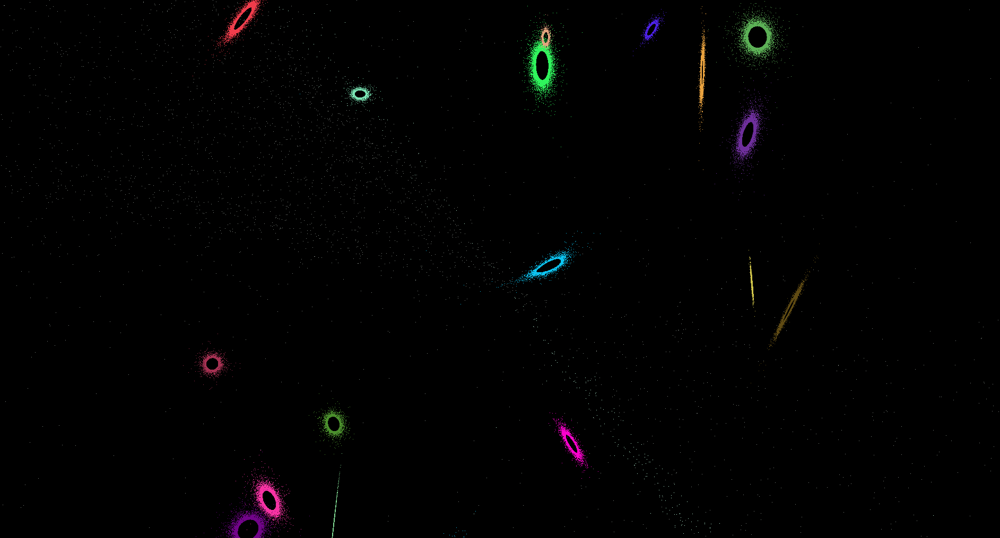
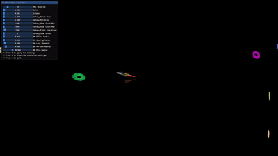

# blackhole-sim

## Controls:

**Left stick, Right, Left:** rotate the camera, X axis

**Left stick, Up, Down:** rotate the camera, Y axis

**Right stick, Up, Down:**  zoom in/out

**R1:** reset galaxies

**L1:** reset blackhole (auto every 5 min.)

 

 

 

